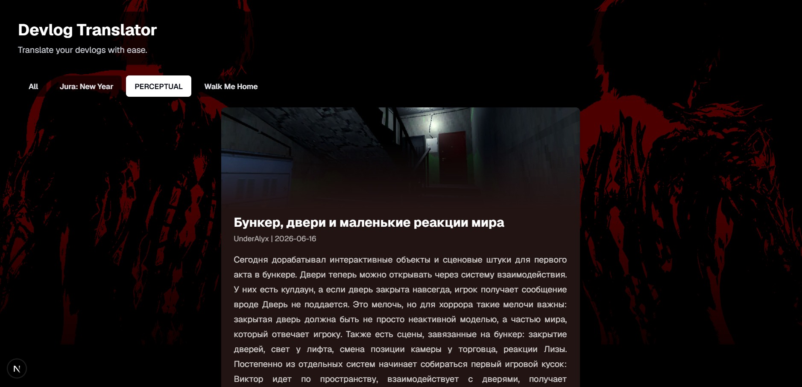
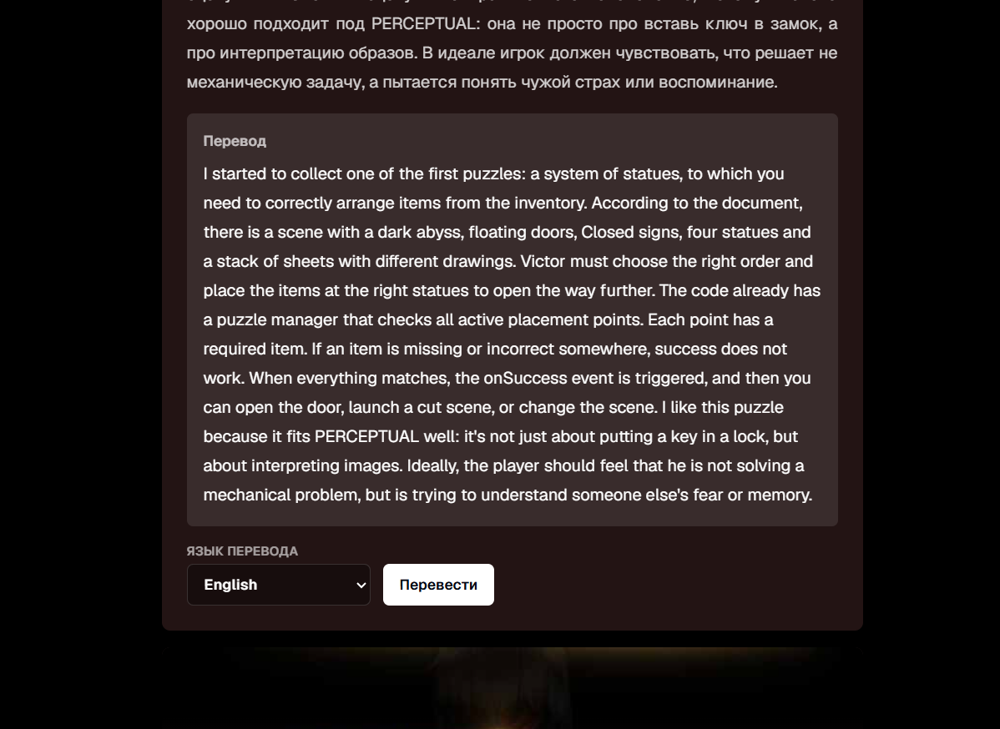

# Devlog Translator



Devlog Translator - веб-сайт для просмотра и перевода девлогов инди-игр. Проект собирает посты по разным играм в единую ленту, позволяет фильтровать их по проектам и переводить текст через Yandex Cloud Translate.



## Команда разработки

- UnderAlyx
- Aleshka228PRO
- papaChill

## Стек

- Next.js 16
- React 19
- TypeScript
- Tailwind CSS 4
- Prisma
- SQLite через встроенный модуль Node.js `node:sqlite`
- Yandex Cloud Translate API
- ESLint

## Информация о проекте

Сайт показывает девлоги игр с обложками, фоновыми изображениями и метаданными постов. Данные о играх и постах хранятся в SQLite-базе `dev.db`, которая заполняется из файлов в `src/lib` с помощью seed-скрипта Prisma.

Перевод работает через API-роут Next.js `src/app/api/translate/route.ts`. Для запросов к переводчику используются переменные окружения Yandex Cloud, а результат дополнительно кэшируется на стороне браузера в `localStorage`.

Основные возможности:

- лента девлогов;
- фильтрация постов по игре;
- перевод постов на выбранный язык;
- локальная SQLite-база для данных сайта;
- адаптивный интерфейс на Next.js.

## Подробный гайд по запуску сайта

### 1. Установите Node.js

Для проекта нужен Node.js с поддержкой `node:sqlite`. Рекомендуется использовать актуальную версию Node.js 22 или новее.

Проверьте версии:

```bash
node -v
npm -v
```

### 2. Перейдите в папку проекта

Если вы находитесь в корне репозитория:

```bash
cd devlog-translator-web
```

### 3. Установите зависимости

```bash
npm install
```

### 4. Создайте файл переменных окружения

В папке `devlog-translator-web` создайте файл `.env`:

```env
DATABASE_URL="file:./dev.db"
YANDEX_API_KEY="ваш_api_ключ_yandex_cloud"
YANDEX_FOLDER_ID="ваш_folder_id_yandex_cloud"
```

Назначение переменных:

- `DATABASE_URL` - путь к локальной SQLite-базе.
- `YANDEX_API_KEY` - API-ключ для Yandex Cloud Translate.
- `YANDEX_FOLDER_ID` - идентификатор каталога в Yandex Cloud.

Если нужно только открыть сайт и посмотреть ленту, база данных всё равно нужна. Переменные Yandex обязательны для работы кнопки перевода.

### 5. Подготовьте базу данных

Сгенерируйте Prisma Client:

```bash
npm run db:generate
```

Примените миграции и создайте SQLite-базу:

```bash
npm run db:migrate
```

Заполните базу начальными данными:

```bash
npm run db:seed
```

После выполнения этих команд в папке проекта появится файл `dev.db`.

### 6. Запустите сайт в режиме разработки

```bash
npm run dev
```

По умолчанию Next.js запустит локальный сервер на адресе:

```text
http://localhost:3000
```

Откройте этот адрес в браузере.

### 7. Проверьте работу

На сайте должна открыться лента девлогов. Проверьте:

- переключение фильтров по играм;
- отображение карточек постов;
- кнопку перевода;
- отсутствие ошибок в терминале.

Если перевод не работает, проверьте значения `YANDEX_API_KEY` и `YANDEX_FOLDER_ID` в `.env`.

## Полезные команды

```bash
npm run dev
```

Запуск сайта в режиме разработки.

```bash
npm run build
```

Сборка production-версии.

```bash
npm run start
```

Запуск production-сборки после `npm run build`.

```bash
npm run lint
```

Проверка кода линтером.

```bash
npm run db:generate
```

Генерация Prisma Client.

```bash
npm run db:migrate
```

Применение миграций базы данных.

```bash
npm run db:seed
```

Заполнение базы начальными данными.
